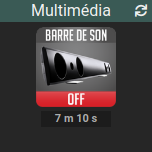
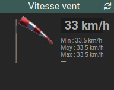

# jeedom-mywidgets

## Présentation

Ensemble des widgets Jeedom les plus populaires et reactualisés pour la V4

Widget                                                    | Dashboard | Mobile | Aperçu                                     | Description
--------------------------------------------------------------- | ----| --- | --------------------------------------------- | -----------
**[Image_OnOff](docs/fr_FR/widget-image-onoff.md)**             | OUI | OUI |        | Image sur une info binaire 
**[Image_0-100](docs/fr_FR/widget-image-0-100.md)**             | OUI | OUI |        | Image sur une valeur de pourcentage
**[Image_value](docs/fr_FR/widget-image-value.md)**             | OUI | OUI |        | Image sur une valeur numérique
**[Image_Gauge](docs/fr_FR/widget-image-gauge.md)**             | OUI | non |        | Gauge numérique
**[Thermometre](docs/fr_FR/widget-thermometre.md)**             | OUI | OUI |        | Gauge thermomètre
**[Meteo](docs/fr_FR/widget-meteo.md)**                         | OUI | OUI |         | Météo (baromètre, humidité, vent, conditions)
**[Image_Channel](docs/fr_FR/widget-image-channel.md)**         | OUI | OUI |      | Commandes sur les chaînes TV
**[Image_Action](docs/fr_FR/widget-image-action.md)**           | OUI | OUI |       | Image sur une commande

## Installation

Depuis Jeedom dans le menu *Plugins* -> *Gestion des plugins*, ajouter un nouveau plugin :

Saisir les champs comme sur la capture suivante :

