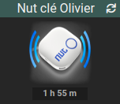
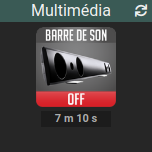
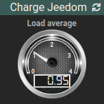
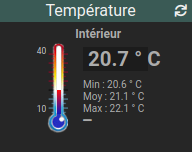
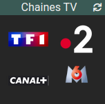

# Plugin TopWidgets

Compilation et amélioration des meilleurs widgets Jeedom.

Widget                                         | Dashboard | Mobile | Aperçu                                   | Description
---------------------------------------------------- | ----| --- | ------------------------------------------- | -----------
**[Image_OnOff](widget-image-onoff.md)**             | OUI | OUI |        | Image sur une info binaire 
**[Image_0-100](widget-image-0-100.md)**             | OUI | OUI |        | Image sur une valeur de pourcentage
**[Image_value](widget-image-value.md)**             | OUI | OUI |        | Image sur une valeur numérique
**[Image_Gauge](widget-image-gauge.md)**             | OUI | non |        | Gauge numérique
**[Thermometre](widget-thermometre.md)**             | OUI | OUI |        | Thermomètre
**[Meteo](widget-meteo.md)**                         | OUI | OUI |         | Météo (baromètre, humidité, vent, conditions)
**[Image_Channel](widget-image-channel.md)**         | OUI | OUI |      | Commandes sur les chaînes TV
**[Image_Action](widget-image-action.md)**           | OUI | OUI |       | Image sur une commande
