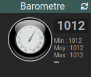

# Widget "Barometre"

Widget pour Jeedom permettant d’afficher un baromètre pour une valeur de type **info numérique**.

## Paramétrage

### Paramétrage du widget

Possiblité de configurer l'affichage du widget avec les paramètres optionnels suivants :

> - **size** : Dimension de l'image en pixels. *(version dashboard et mobile)*
> - **size_dashboard** : Dimension de l'image en pixels en version dashboard
> - **size_mobile** : Dimension de l'image en pixels en version mobile
> - **style** : Style CSS du widget. *(version dashboard et mobile)*
> - **style_dashboard** : Style CSS du widget en version dashboard
> - **style_mobile** : Style CSS du widget en version mobile
> - **position** : Position de l'image. Valeurs possibles (left, right, bottom) *(Par défaut : left)*
