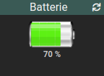
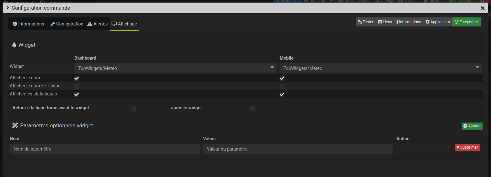

# Widget "Image_0-100"

Widget pour Jeedom permettant d’afficher une image pour une valeur de type **info numérique** allant de 0 à 100.

## Paramétrage

### Paramétrage de la commande

Il est conseillé de remplir la valeur du ***type générique*** de la configuration de la commande dans l'onglet *Configuration*

### Paramétrage du widget

Paramètres à ajouter dans ***Paramètres optionnels widget***

#### Possiblité de choisir l'image optionnel suivant :

Nom du paramètre | Valeur par défaut    | Valeurs possibles | Description
---------------- | -------------------- | ----------------- | -----------
**type**         | ***type générique*** | battery equipment flap_state humidity | Type de la valeur de l'image
**logo**         | defaut               | Choix du nom de l'image dans le dossier du **type** | Nom du logo

#### Possiblité de configurer l'affichage du widget avec les paramètres optionnels suivants :

Nom du paramètre     | Valeur par défaut | Valeurs possibles | Dashboard | Mobile | Description
-------------------- | ----------------- | ----------------- | --------- | ------ | -----------
**size**             | 80                | [0-9]+            | Oui       | Oui    | Dimension de l'image en pixels.
**size_dashboard**   | *size*            | [0-9]+            | Oui       | Nom    | Dimension de l'image en pixels en version dashboard
**size_mobile**      | *size*            | [0-9]+            | Non       | Oui    | Dimension de l'image en pixels en version mobile
**style**            |                   | code css          | Oui       | Oui    | Style CSS du widget.
**style_dashboard**  | *style*           | code css          | Oui       | Non    | Style CSS du widget en version dashboard
**style_mobile**     | *style*           | code css          | Non       | Oui    | Style CSS du widget en version mobile
**stats**            | light             | light full        | Oui       | Non    | Si on coche *Afficher les statistiques*, il est possible d'afficher les stats en dessous (valeur light) ou à droite de l'image (valeur full)

#### Possiblité d'affichage des informations de temps depuis le dernier allumage/extinction :

Nom du paramètre     | Valeur par défaut | Valeurs possibles | Dashboard | Mobile |  Description
-------------------- | ----------------- | ----------------- | --------- | ------ | -----------
**time**             |                   | duree             | Oui       | Non    |  
