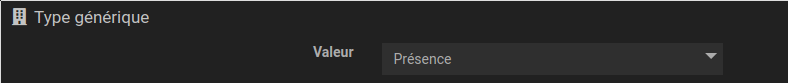

# Widget "Image_0-100"

Widget pour Jeedom permettant d’afficher une image pour une valeur de type **info numérique** allant de 0 à 100.

## Paramétrage

### Paramétrage de la commande

Il est conseillé de remplir la valeur du ***type générique*** de la configuration de la commande dans l'onglet *Configuration*

### Paramétrage du widget

Possiblité de choisir l'image optionnel suivant :

> - **type** : Type de la valeur de l'image (Par défaut c'est le type générique défini plus haut)
> - **logo** : Choix du nom de l'image dans le dossier du **type** (Par défaut : defaut)

Possiblité de configurer l'affichage du widget avec les paramètres optionnels suivants :

> - **size** : Dimension de l'image en pixels. *(version dashboard et mobile)*
> - **size_dashboard** : Dimension de l'image en pixels en version dashboard
> - **size_mobile** : Dimension de l'image en pixels en version mobile
> - **style** : Style CSS du widget. *(version dashboard et mobile)*
> - **style_dashboard** : Style CSS du widget en version dashboard
> - **style_mobile** : Style CSS du widget en version mobile
