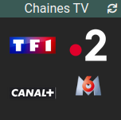

# Widget "Image_Channel"

Widget pour Jeedom permettant d’afficher le logo d'une chaine TV de type **action**.

## Paramétrage

### Paramétrage du widget

Paramètres à ajouter dans ***Paramètres optionnels widget***

#### Possiblité de choisir l'image suivant :

Nom du paramètre | Valeur par défaut    | Valeurs possibles                                | Description
---------------- | -------------------- | ------------------------------------------------ | -----------
**logo**         | Nom de la commande   | Nom du canal (nom dans le dossier `channels`)    | Choix du nom de la chaîne

#### Possiblité de configurer l'affichage du widget avec les paramètres optionnels suivants :

Nom du paramètre     | Valeur par défaut | Valeurs possibles | Dashboard | Mobile | Description
-------------------- | ----------------- | ----------------- | --------- | ------ | -----------
**scale**            | 100               | Entre 0 et 200    | Oui       | Oui    | Dimension de l'image en pourcentage.
**scale_dashboard**  | *scale*           | Entre 0 et 200    | Oui       | Nom    | Dimension de l'image en pourcentage en version dashboard
**scale_mobile**     | *scale*           | Entre 0 et 200    | Non       | Oui    | Dimension de l'image en pourcentage en version mobile
**style**            |                   | code css          | Oui       | Oui    | Style CSS du widget.
**style_dashboard**  | *style*           | code css          | Oui       | Non    | Style CSS du widget en version dashboard
**style_mobile**     | *style*           | code css          | Non       | Oui    | Style CSS du widget en version mobile
