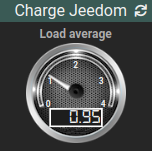

# Widget "Image_Gauge"

Widget pour Jeedom permettant d’afficher une gauge pour une valeur de type **info numérique**

## Paramétrage

### Paramétrage de la commande

Il est conseillé de remplir les valeurs minimales et maximales de la configuration de la commande dans l'onglet *Informations*

### Paramétrage du widget

Paramètres à ajouter dans ***Paramètres optionnels widget***

#### Possiblité de configurer l'affichage du widget avec les paramètres optionnels suivants :

Nom du paramètre | Valeur par défaut | Valeurs possibles                                           | Description
---------------- | ----------------- | ----------------------------------------------------------- | -----------
**color**        | white             | blue, green, orange, pink, purple, turquoise, white, yellow | Choix de la couleur de la gauge
**size**         | medium            | small, medium, large                                        | Dimension du widget

#### Possibilité de changer la couleur de la gauge en fonction d'un dépassement de seuil de valeur :

Nom du paramètre     | Valeur par défaut | Valeurs possibles | Description
-------------------- | ----------------- | ----------------- | -----------
**alert_warning**    |                   | [0-9]+            | Choix de la couleur de la gauge
**alert_critical**   |                   | [0-9]+            | Dimension du widget

> - **alert_warning** : Seuil au delà le widget passera à la couleur *orange*
> - **alert_critical** : Seuil au delà le widget passera à la couleur *rouge*
