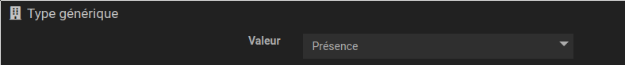
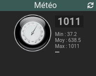
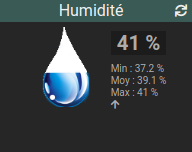
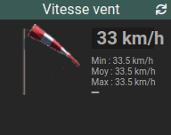
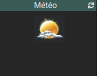
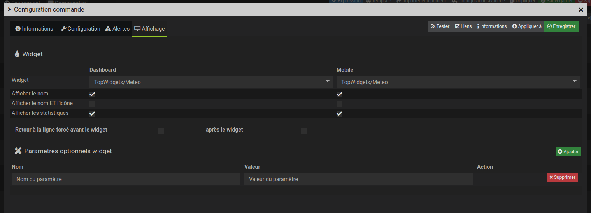

# Widget "Meteo"

Widget pour Jeedom permettant d’afficher les différentes mesures (condition, baromètre, humidité, vitesse du vent) météo pour une valeur de type **info numérique**.

## Paramétrage

### Paramétrage de la commande

Il est obligatoire de remplir la valeur du ***type générique*** de la configuration de la commande dans l'onglet *Configuration*

Aperçu                                    | Valeur du type générique
----------------------------------------- | ------------------------
 | Météo pression
  | Météo humidité
      | Météo vitesse du vent
 | Météo condition (id)

### Paramétrage du widget

Paramètres à ajouter dans ***Paramètres optionnels widget***

#### Possiblité de configurer l'affichage du widget avec les paramètres optionnels suivants :

Nom du paramètre     | Valeur par défaut | Valeurs possibles | Dashboard | Mobile | Description
-------------------- | ----------------- | ----------------- | --------- | ------ | -----------
**size**             | 80                | [0-9]+            | Oui       | Oui    | Dimension de l'image en pixels.
**size_dashboard**   | *size*            | [0-9]+            | Oui       | Nom    | Dimension de l'image en pixels en version dashboard
**size_mobile**      | *size*            | [0-9]+            | Non       | Oui    | Dimension de l'image en pixels en version mobile
**style**            |                   | code css          | Oui       | Oui    | Style CSS du widget.
**style_dashboard**  | *style*           | code css          | Oui       | Non    | Style CSS du widget en version dashboard
**style_mobile**     | *style*           | code css          | Non       | Oui    | Style CSS du widget en version mobile
**position**         | right             | left right bottom | Oui       | Oui    | Position des statistiques
