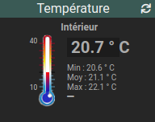

# Widget "Image_Value"

Widget pour Jeedom permettant d’afficher un thermomètre pour une valeur de type **info numérique**.

## Paramétrage

### Paramétrage de la commande

Il est conseillé de remplir les valeurs minimales et maximales de la configuration de la commande dans l'onglet *Informations*
